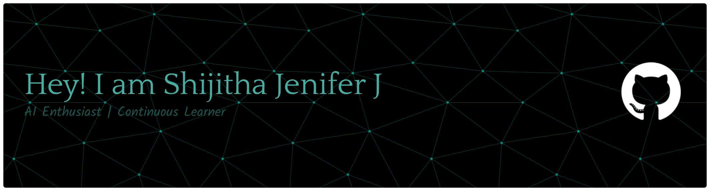

---

  

  

---

## About Me

I'm **Shijitha Jenifer**, someone who enjoys finding patterns where others see data and turning curiosity into practical solutions.

I naturally gravitate toward solving problems through technology, whether it's exploring AI, building data-driven solutions, or learning cloud technologies that power modern applications.

Instead of chasing trends, I prefer understanding **how systems work behind the scenes** and building skills that create long-term impact.

- 🎓 **Currently studying:** B.Tech Artificial Intelligence & Data Science
- 🏫 **VSB College of Engineering and Technical Campus, Coimbatore**

---

## Tech Stack

### Programming

  
  

### Database

  

### Visualization

  
  

### Tools

  
  
  

---

## Currently Learning

  
  

---

## GitHub Analytics

  
  

  

### Contribution Activity

  

---

## LeetCode

  

---

## Connect With Me

  
  
  

*"Learning today. Building tomorrow."*

